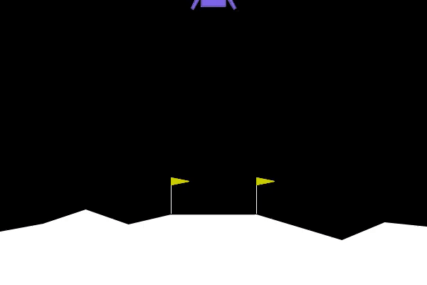
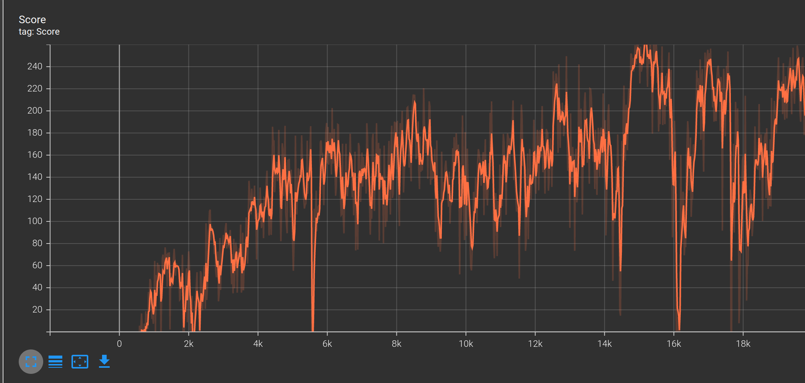

# Gymnasium Lunar Lander

This is a Pytorch-based implementation of the DQN for training Farama's Gymnasium's Lunar Lander

## Run Instructions

- The anaconda environment can be installed using the environment.yml file:\
`conda env create --file environment.yml`

- Run the main.py file:\
`python main.py`

## Results

Here's a video of the Lunar Lander in action:

Plot for the scores achieved while training:

